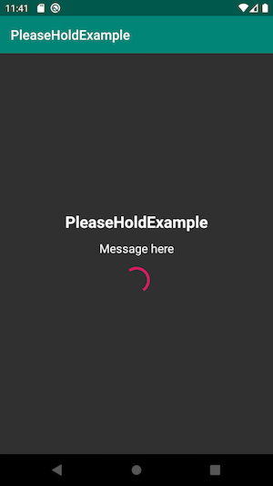
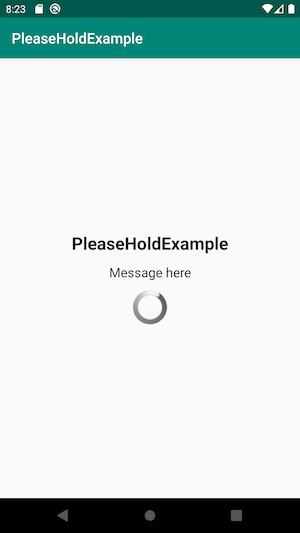

[](https://bintray.com/levibostian/PleaseHold/com.levibostian.pleasehold/_latestVersion)
[](https://github.com/levibostian/PleaseHold-Android/blob/master/LICENSE)

# PleaseHold

Quick and easy progress view to place in your app.

*iOS developer? Check out [the iOS version of PleaseHold!](https://github.com/levibostian/pleasehold-ios)*

## What is PleaseHold?

In the moments when you need to show a blocking progress view in your app, PleaseHold is a quick way to put one in your app. Configured with default settings that will work for most use cases, but customizable enough to cover more. Do us all a favor, and avoid blocking views as much as you can 😉.



## Why use PleaseHold?

* Kotlin API
* Lightweight. Zero dependencies.
* UI testing friendly.
* Setup with default values that should work for 95% of your use cases. Fully customizable for those other cases.
* Default look *just works* for dark mode.

I recommend you check out 2 other libraries that work nicely with PleaseHold: [Empty](https://github.com/levibostian/Empty-Android) and [Swapper](https://github.com/levibostian/Swapper-Android).

## Installation

To install PleaseHold, simply add the following line to your `build.gradle` file:

```
implementation 'com.levibostian.pleasehold:pleasehold:version-goes-here'
```

Replace `version-here` with: [](https://bintray.com/levibostian/PleaseHold/com.levibostian.pleasehold/_latestVersion) which is the latest version at this time.

## Getting started

* Add an instance of `PleaseHoldView` to your layout:

```xml
<?xml version="1.0" encoding="utf-8"?>
<LinearLayout xmlns:android="http://schemas.android.com/apk/res/android"
    xmlns:app="http://schemas.android.com/apk/res-auto"
    xmlns:tools="http://schemas.android.com/tools"
    android:layout_width="match_parent"
    android:layout_height="match_parent">

    <com.levibostian.pleasehold.PleaseHoldView
        android:layout_width="match_parent"
        android:layout_height="match_parent"
        app:pleasehold_title_text="@string/app_name"
        app:pleasehold_message_text="Message here"/>

</LinearLayout>
```

Notice the use of custom attributes `PleaseHold` provides to you.

| Attribute                   | Notes                          |
|-----------------------------|--------------------------------|
| app:pleasehold_title_text   | Sets text for title TextView   |
| app:pleasehold_message_text | Sets text for message TextView |

...if adding views programmatically is more your style, you can do that too...

```kotlin
val pleaseHoldView = PleaseHoldView(ContextThemeWrapper(context, R.style.PleaseHoldView_Custom), null, R.style.PleaseHoldView_Custom).apply {
    title = "Title"
}

parent_view.addView(pleaseHoldView)
```

*Note: The Kotlin code above sets a style to the `PleaseHoldView` instance. If you want to use the default style set in your app's theme, you can simply use `PleaseHoldView(context)`.*

* Optionally, set properties on your `PleaseHoldView` instance to change what the View displays:

```kotlin
pleasehold_view.title = getString(R.string.text)
pleasehold_view.message = "Message here"
```

Set the text that the Title and Message `TextView`s show. If you set `null` as the title or message, the corresponding `TextView` will have a visibility set to `GONE` to hide it.

Awesome! You're done! Even though it's optional, it's recommended to read below on how to customize the look of `PleaseHoldView`. At the very least, customize the `ProgressBar` as the default Android one is quite dated.

# Customize look of `PleaseHoldView`


> Here is the default look of `PleaseHoldView`. Notice how it looks pretty good using default Android styles. But, the `ProgressBar` is quite dated. It's recommended to at least style that.

You have full control over the look of your `PleaseHoldView`. All of the `TextView`s and the `ProgressBar` can be styled. Here is how.

PleaseHold relies heavily on Android Styles and Themes to customize the look of your `PleaseHoldView` instance. If you are not familiar with how styles and themes work, I recommend you checkout [the official guide on styles and themes](https://developer.android.com/guide/topics/ui/look-and-feel/themes) before you jump into this doc.

The first step to customizing your `PleaseHoldView` is to create a custom style. In your `styles.xml` file for your app, create a new custom style for the `PleaseHoldView`:

```xml
<style name="PleaseHoldView.Custom">
</style>
```

Now, when you want to use this custom style on an instance of `PleaseHoldView` in your app, provide this style either in the XML layout:

```xml
<com.levibostian.pleasehold.PleaseHoldView
    android:layout_width="match_parent"
    android:layout_height="match_parent"
    style="@style/PleaseHoldView.Custom"/>
```

Or, if you want to set your custom style as the default style for *all* instances of `PleaseHoldView` in your app, apply this to your app's theme:

```xml
<style name="AppTheme" parent="Theme.AppCompat.Light.DarkActionBar">
    <item name="pleaseholdview_style">@style/PleaseHoldView.Custom</item>
</style>
```

Now, the custom style, `PleaseHoldView.Custom`, at this time doesn't do anything. Why? Because the style is empty. You have done the base work in order to customize the look of `PleaseHoldView` instances. Keep reading to learn how you can customize the Views.

### Style title `TextView`

* Create a custom style for the `PleaseHoldView.TitleTextView` and override anything you wish!

```xml
<style name="PleaseHoldView.TitleTextView.Custom">
    <item name="android:textColor">@color/colorPrimary</item>
    <item name="android:padding">30dp</item>
</style>
```

* Then, apply this custom style to an `PleaseHoldView` custom style you have created already:

```xml
<style name="PleaseHoldView.Custom">
    <item name="pleaseholdview_titleTextView">@style/PleaseHoldView.TitleTextView.Custom</item>
</style>
```

### Style message `TextView`

Follow the instructions for *Style title `TextView`* except override `PleaseHoldView.MessageTextView` instead of `PleaseHoldView.TitleTextView` and use `<item name="pleaseholdview_messageTextView">` instead of `<item name="pleaseholdview_titleTextView">` as the `PleaseHoldView` style custom attribute.

### Style `ProgressBar`

* Create a custom style for the `PleaseHoldView.ProgressBar` and override anything you wish!

```xml
<style name="PleaseHoldView.ProgressBar.Custom"  parent="Widget.AppCompat.ProgressBar">
    <item name="android:layout_height">30dp</item>
    <item name="android:padding">@dimen/com_levibostian_pleaseholdview_view_padding</item>
</style>
```

* Then, apply this custom style to an `PleaseHoldView` custom style you have created already:

```xml
<style name="PleaseHoldView.Custom">
    <item name="pleaseholdview_progressBar">@style/PleaseHoldView.ProgressBar.Custom</item>
</style>
```

## Example

PleaseHold comes with an example app you can use to play with the library. To run the example project, clone the repo and then open it up in Android Studio.

## Development

PleaseHold is a pretty simple Android library project. At this time, all you need to do is open up the project in Android Studio and you are ready to go!

## Author

* Levi Bostian - [GitHub](https://github.com/levibostian), [Twitter](https://twitter.com/levibostian), [Website/blog](http://levibostian.com)


## Contribute

PleaseHold is open for pull requests. Check out the [list of issues](https://github.com/levibostian/PleaseHold-android/issues) for tasks I am planning on working on. Check them out if you wish to contribute in that way.

**Want to add features to PleaseHold?** Before you decide to take a bunch of time and add functionality to the library, please, [create an issue](https://github.com/levibostian/PleaseHold-android/issues/new) stating what you wish to add. This might save you some time in case your purpose does not fit well in the use cases of PleaseHold.

## License

PleaseHold is available under the MIT license. See the LICENSE file for more info.